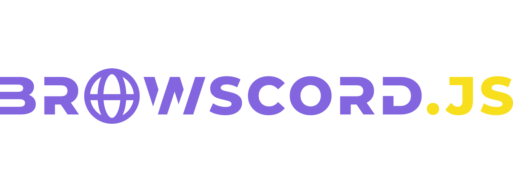

<div align="center">
	<br />
	<p>
		<a href="https://github.com/JasonBenfrin/browscord.js"></a>
	</p>
	<br />
</div>

# WIP!

This library is still in development. Thanks for checking it out! ❤️

## About

A simple and easy library to interact with [Discord API](https://discord.com/developers/docs/intro) with your browser.

## Requirements

- I don't know yet I'll edit later

## Usage

1. Download the [browscord.js](./dist/browscord.js) file and add it to your project
2. Load the script using a script tag
```html
<script src="./browscord.js">
```
3. You can access the library in your javascript file using `Discord` or `window.Discord`
```js
const { Client } = window.Discord
const client = new Client({ intents: 515 })
client.login("TOKEN")
```

## Milestones

- Make it object oriented like [discord.js](https://github.com/discordjs/discord.js)
- Make most features available in [discord.js](https://github.com/discordjs/discord.js) also available in [browscord.js](https://github.com/JasonBenfrin/browscord.js)
- Make sharding available
- Make a guide or tutorial